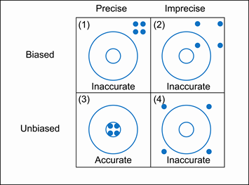
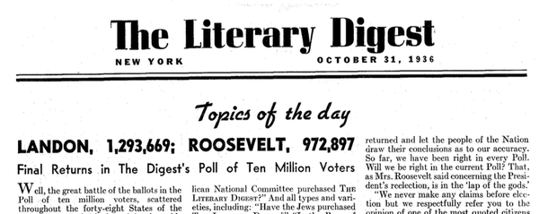

# Design Observational Studies and Experiments


**Learning Outcome:**

---
*Select a suitable sampling design {simple random, systematic, stratified, cluster}, given information about the observational study or experiment.*  
---

The chapter introduces two main types of statistical studies, namely observational studies and experiments. Also discussed here are their benefits and drawbacks and how to design them well.


## Variable

In statistics, a variable is a characteristics of the individuals to be measured or observed.

**Types of Variables**


<span style="color:#386cb0">
**1. CATEGORICAL (or QUALITATIVE)** </span> - consist of names or labels (not numbers that represent counts or measurements)

**- Nominal (unordered):** the data fall into categories that have no particular order or ranking in relation to each other, e.g., <br> 
color (blue, green, red,...), <br>
gender (male, female),        <br>
nationality (American, Canadian, Mexican,...)

**- Ordinal (ordered):**  values have a natural order to ranking, e.g., <br>
temperature (low, medium, high),  <br> 
exam grade (A, B, C, D, F), <br>
satisfaction (high, neutral, low) 


<span style="color:#386cb0">
**2. NUMERICAL (or QUANTITATIVE)** </span> - consist of numbers representing measurements or counts.

**- Continuous:** a subject or observation takes a value from an interval of real numbers, e.g., weight, height, age, etc.


**- Discrete:** a subject or observation takes certain values from a finite set, e.g. population, traffic volume, etc.


Continuous and discrete variables can be further categorized as either *interval* or *ratio* variables.

***Interval Variables:*** these variables are measured along a continuum, and they have the property that equal differences between measures represent equal differences in the values of the variable. For example, temperature measured in degrees Celsius or Fahrenheit. So the difference between $20^\circ C$ and $30^\circ C$ is the same as $30^\circ C$ to $40^\circ C$. However, temperature measured in degrees Celsius or Fahrenheit is NOT a ratio variable.


***Ratio Variables:*** these variables have all the properties of interval variables, but in addition have the property that the ratio variable has a meaningful absolute zero. For example, temperature measured in degrees Celsius or Fahrenheit is not a ratio variable because $0^\circ C$ does not mean there is no temperature. Other examples of ratio variables include height, mass, distance and many more. The name "ratio" reflects the fact that you can use the ratio of measurements. So, for example, a distance of ten meters is twice the distance of $5$ meters.


## Statistics

Statistical studies are designed by the following five steps:

1. **Raise a precise question about one or more variables.**

2. **Design a plan to answer the question.**

3. **Collect the data.**

4. **Analyze the data.**

5. **Draw a conclusion from the data about the question.**


## Data Collection 
The first step in conducting research is to identify topics or questions that are to be investigated.
A clearly laid out research question is helpful in identifying what subjects or cases
should be studied and what variables are important. It is also important to consider how
data are collected so that they are reliable and help achieve the research goals.


**The Goal**
Learn about the entire group of individuals


**The Problem**
It is usually impossible to collect data on the entire population   


 * expensive   
 * time consuming   
 * impossible to find everyone   
 * not everyone willing to participate   
 * population changing constantly - births and deaths   


**The Compromise** 
Collect data on a smaller group of individuals selected from the population

**The Challenge** 
Bias (double-counting and under-counting)


## Sampling from a Population 

**Population** is the complete collection of all measurements or data that are being considered. Typically, a population is the complete collection of data that we would like to make inference about. 

**Census** is the collection of data from every member of the population.

**Sampling Frame** is a numbered list of all the individuals in the population from which a sample is drawn.

**Sample** is a subcollection of members selected from a population.

Because populations are often very large, a common objective of the use of statistics is to obtain data from a sample and then use those data to form a conclusion about the population.

```{r surveySample, echo=F, out.width = "900px"}
knitr::include_graphics("surveySample.png")
```

**Example:** Identify the Variable, Sample, and Population of a Study

In a poll of $1000$ randomly selected American adults, $48\%$ of respondents said that they strongly disapprove of the way Congress is doing its job. The study then made an inference about all American adults.

a. Define the variable of the study.
b. Identify the sample.
c. Identify the population.


## Statistical Inference

**Inferential Statistics** is the practice of using information from a sample to draw conclusions about the entire population. 


It is the process of making judgments about the parameters of a population and the reliability of statistical relationships, typically on the basis of random sampling.   

$\require{AMScd}$
        $$
        \begin{CD}
        Sample @> {\text {statistical inference}} >> Population
        \end{CD}
        $$

$$\underbrace{\text {sample statistics}}_{\text{investigator knows}} = \underbrace{\text {population parameter}}_{\text{investigator wants to know}} + \underbrace{\text {bias}}_{\text{nonsampling error}} + \underbrace{\text {chance variation}}_{\text{random sampling error}}
$$

## Sampling Errors

<span style="color:#386cb0"> **RANDOM SAMPLING ERROR** </span> - occurs when the sample has been selected with a random method, but there is a discrepancy between a sample result and the true population result.

<span style="color:#386cb0"> **NONSAMPLING ERROR** </span> - is the results of human error, including such factors as wrong data entries, computing errors, questions with biased wording, false data provided by respondents, forming biased conclusions, or applying statistical methods that are not appropriate for the circumstances.

A sampling method that consistently underestimates or overestimates some characteristics of the population is said to be **biased**.

* **Selection/Sampling bias** - occurs when the sample is selected in such a way that it systematically excludes or underrepresented part of the population.
    * An online survey conducted to estimate the percentage of Americans who have a Facebook account.
    * The survey is biased because people who go online are favored.
    * People who never go online cannot participate in the poll.

* **Nonresponse bias** - occurs when responses are not obtained from all individuals selected for inclusion in a sample. It happens if individuals refuse to be part of the study or if the research cannot track down individuals identified to be in the sample.

* **Measurement or response bias** - occurs when the data are collected in such a way that it tends to result in observed values that are different from the actual value in some systematic way. Contributing factors: question wording and order; mode of survey; influence of the interviewer; people might exaggerate how much money they earn; or a researcher might record the information incorrectly etc.

Response bias can also result from the wording of questions. For example, compare the impact of the following two questions:

1. Do you brag about your past successes with others?
2. Do you inspire others by sharing your past successes?
3. Do you share your past successes with others?

  
<span style="color:#386cb0"> **NONRANDOM SAMPLING ERROR** </span> - is the results of using a sampling method that is not random, such as using a convenience sample or a voluntary response sample.


## Bias and Precision

**Bias**  
The average difference between the estimator and the true value.   

**Precision**   
The standard deviation of the estimator. 

<div class="centered"> 

```{r echo=F, out.width = "400px"}

```
</div>


$$
\begin{aligned}
\text{Mean Squared Error, MSE} &= precision^2 + bias^2 \\
\text{Root Mean Squared Error, RMSE} &= \sqrt{MSE}
\end{aligned}
$$


## Parameter and Statistic

A **parameter** is a numerical measurement describing some characteristics of a population.

A **statistic** is a numerical measurement describing some characteristics of a sample.  

Example: 

There are $17,246,372$  high school students in the U.S. In a study of $8505$ U.S. high school students $16$ years of age or older, $44.5\%$ of them said that they texted while driving at least once during the previous $30$ days.


1. Parameter: What percent of the population texted while driving? (unknown)
2. Statistic: $44.5\%$
 

**Exercise 2.1**  10, 36, 38, 40, 42, 44, 46, 48


## Simple Random Sampling (SRS)

A simple random sample of *n* subjects is selected in such a way that every possible sample of the sample size *n* has the same chance of being chosen.

---
In statistics a sample of a population is said to be **random** if each member in the population has an equal chance of being chosen.
---


**Sampling with replacement** -  an individual is selected more than once.

**Sampling without replacement** - an individual is selected only once.


```{r, echo=FALSE, message=FALSE, warning=FALSE}
library(openintro)
source("SamplingMethodsFunctions.R")
data(COL)
N   <- sample(100:200, 1)
n   <- sample(20:50, 1)
colSamp <- COL[4]
PCH <- rep(c(1, 3, 20)[3], 3)

col <- rep(COL[1], N)
pch <- PCH[match(col, COL)]

BuildSRS()
```

^*Source: OpenIntro.Org*^


## Stratified Sampling
1. The population is divided into <span style="color:#b2182b"> **non-overlapping, homogeneous** </span> subgroups called <span style="color:#b2182b"> **strata** </span>.
2. Then, SRS is employed to select a certain number or a certain proportion of the whole within each stratum.

```{r, echo=FALSE, message=FALSE, warning=FALSE}
BuildStratified()
```

^*Source: OpenIntro.Org*^


**Example: Stratified Sampling**

Design a sample to survey $500$ students using stratified sampling method.

$$ \text { Strata Sizes }  
\bbox[white,4px]
{
\color{black}
{
\begin{array}{c|c|c|c}
\text{Gender}  & \text{Undergraduate} & \text{Graduate} & \text{Total} \\
\hline
\text{Female} & \text{3355} & \text{4693} & \text{8048} \\
\text{Male} & \text{3734} & \text{6687} & \text{10421} \\
\hline
\text{Total} & \text{7089} & \text{11380} & \text{18469} \\
\end{array}
}
}
$$

$$ \text { Strata Proportions } 
\bbox[yellow,4px]
{
\color{black}
{
\begin{array}{c|c|c|c}
\text{Gender}  & \text{Undergraduate} & \text{Graduate} & \text{Total} \\
\hline
\text{Female} & \text{3355/18469 = .182} & \text{.254} & \text{.436} \\
\text{Male} & \text{.202} & \text{.362} & \text{.564} \\
\hline
\text{Total} & \text{.384} & \text{.616} & \text{1.000} \\
\end{array}
}
}
$$

$$ \text { Sample sizes }   
\bbox[lightblue,4px]
{
\color{black}
{
\begin{array}{c|c|c|c}
\text{Gender}  & \text{Undergraduate} & \text{Graduate} & \text{Total} \\
\hline
\text{Female} & \text{.182(500)=91} & \text{127} & \text{218} \\
\text{Male} & \text{101} & \text{181} & \text{282} \\
\hline
\text{Total} & \text{192} & \text{308} & \text{500} \\
\end{array}
}
}
$$

**Practice**

Design a sample to survey $1200$ students using stratified sampling method.


$$  
\bbox[white,4px]
{
\color{black}
{
\begin{array}{c|c|c|c}
\text{Gender}  & \text{Undergraduate} & \text{Graduate} & \text{Professional} \\
\hline
\text{Female} & \text{10588} & \text{4475} & \text{1421} \\
\text{Male} & \text{7762} & \text{3736} & \text{1153} \\
\hline
\end{array}
}
}
$$

## Cluster Sampling

1. The population is often divided into <span style="color:#b2182b"> **non-overlapping mutually homogeneous yet internally heterogeneous**</span> subgroups called <span style="color:#b2182b"> **clusters.** </span> Cluster sampling is much like SRS, but instead of randomly selecting *individuals*, SRS is applied to select clusters.
    + In other words, unlike stratified sampling, cluster sampling is most helpful when there is a lot of case-to-case variability within a cluster but the clusters themselves don't look very different from one another. That is, we expect strata to be <span style="color:#b2182b"> **self-similar (homogeneous),** </span> while we expect clusters to be <span style="color:#b2182b"> **diverse (heterogeneous).** </span>
2. The elements in each cluster are then sampled. If all elements in each sampled cluster are sampled, then this is referred to as a <span style="color:#b2182b"> **"one-stage" cluster sampling plan.** </span>
3. Sometimes cluster sampling can be a more economical random sampling technique
than the alternatives. For example, if neighborhoods represented clusters, this sampling
method works best when each neighborhood is very diverse. Because each neighborhood
itself encompasses diversity, a cluster sample can reduce the time and cost associated with
data collection, because the interviewer would need only go to some of the neighborhoods
rather than to all parts of a city, in order to collect a useful sample.
  

**One-Stage Cluster Sampling**  

```{r, echo=FALSE, message=FALSE, warning=FALSE}
BuildCluster()
```

^*Source: OpenIntro.Org*^

**Multistage Cluster Sampling**

A <span style="color:#b2182b"> **"multistage" or "multistage cluster"** </span> sampling is an extention of cluster sampling and involves two (or more) steps.    

1. First step is to take a cluster sample.
2. Then, instead of including all of the individuals in these clusters in the sample, a second sampling method,
usually SRS, is employed within each of the selected clusters.   

In the neighborhood example, we could first randomly select some number of neighborhoods and then take a SRS from just those selected neighborhoods. As seen in Figure, stratified sampling requires observations to be sampled from every stratum. Multistage sampling selects observations only from those clusters that were randomly selected in the first step.   


It is also possible to have more than two steps in multistage sampling. Each cluster may be naturally divided into subclusters. For example, each neighborhood could be
divided into streets. To take a three-stage sample, we could first select some number of clusters (neighborhoods), and then, within the selected clusters, select some number of
subclusters (streets). Finally, we could select some number of individuals from each of the selected streets.

```{r, echo=FALSE, message=FALSE, warning=FALSE}
BuildMultistage()
```

^*Source: OpenIntro.Org*^


## Nonrandom Sampling

<span style="color:#386cb0"> **Systematic Sampling** </span>   

Select every $k^{th}$ individual froma list of the population, where the position of the first person chosen is randomly selected from the $k$ individuals. This will give a non-representative sample if there is a structure to the list.

```{r, echo=FALSE, message=FALSE, warning=FALSE}
BuildSystematic()
```

^*Source: OpenIntro.Org*^

**Solve:**

The human resource department at a certain company wants to conduct a survey regarding worker benefits. The department has an alphabetical list of all $5465$ employees at the company and wants to conduct a systematic sample of size $60$.

(a)  What is $k$?


(b)  Determine the individuals who will be administered the survey. Randomly select a number from $1$ to $k$.  Suppose that we randomly select $10$. Starting with the first individual selected, the individuals in the survey will be 


<span style="color:#386cb0"> **Convenience or Volunteer Sampling** </span>   
Use the first $n$ individuals that are available or the individuals who volunteer to participate. This is almost sure to give a non-representative sample which cannot be generalized to the population.

---

**Example: Non-Representative Sample** 

<div class="centered">  </div>   


**Survey**   

* Surveyed 10 million people who were subcribers or had telephones.
* 2.4 million people responded (i.e. 24% response rate)

**Prediction**       
Landslide victory of Landon.

**Election Result**    
Landslide victory of Roosevelt.

**What did go wrong with the poll?**

* Sample was drawn from telephone directories, club membership, magazine subscibers, etc. who were upper middle class people, largely excluding poor unemployed people. 
* The sample suffered from both selection and nonresponse bias.

---


**Exercise: Identifying Sampling Methods**

1. A researcher randomly selects 20 Taco Bell locations and surveys all the employees at those locations.

2. A news station hosts a call-in survey about whether physician-assisted death should be legalized in all states.

3. A researcher randomly selects an LED TV out of the first 200 LED TVs on an assembly line and also selects every 200th LED TV after that.

4. In a study at a community college, 30 instructors are randomly selected from fulltime instructors and 50 instructors are selected from part-time instructors.

5. The City Hall of Spring Hill, Kansas, creates a frame of its 5730 residents and randomly selects 60 residents.
 

## Explanatory and Response Variables 

In statistical studies, we want to know whether a variable $x$ explains (or affects) another variables $y$.
The $x$ variable is called the **explanatory or independent variable**.
The $y$ variable is called the **response or dependent variable**.


**Association vs. Causation**

There is an ***association*** between an explanatory and response variable when the response variable changes as the explanatory variable changes.

If the change in the explanatory variable *causes* the change in the response variable, then there is a ***causation*** between the variables.


## Observational Studies 

Generally, data in observational studies are collected on specific characteristics only by passively monitoring study participants, but the observers don't attempt to modify the individuals being studied. These studies are inexpensive and good for discovering relationships related to rare outcomes. They are generally only sufficient to show associations.    


Types of observational studies:

<span style="color:#386cb0"> **1. Cross-sectional Studies** </span>
- data are observed, measured, and collected at one point in time, not over a period of time.

<span style="color:#386cb0"> **2. Retrospective Studies** </span>
- data are collected from a past time period by going back in time (through examinations of records, interviews, and so on).

<span style="color:#386cb0"> **3. Prospective (or longitudinal or cohort) Studies** </span>
- data are collected in  the future from groups that share common factors (such groups are called cohorts).


**Case Study 1: why did Fido and Fluffy die?**


Early 2007, many dogs and cats died of kidney failure. Should you conduct a retrospective or prospective study to find out why?


<span style="color:#386cb0"> **Retrospective Studies** </span> could be appropriate since

* The event happened in the past.
* It may have been a rare event.
* The retrospective study may provide clues on the cause.    

Once possible causes are identified, try a <span style="color:#386cb0"> **Prospective Studies** </span> to verify the causes - if it doesn't kill any pets.


**Case Study 2: drinking coffee and longevity**

Coffee drinkers may live longer - *nytimes.com, May 16, 2012.*       

Coffee may help you live longer, study suggests - *thestar.com, May 17, 2012.*    

No, drinking coffee probably won't make you live longer - *washingtonpost.com, May 17, 2012.*

Association of coffee drinking with total and cause-specific mortality," *New England Journal of Medicine*, May 2012.  

Sample Size: **400,000**

Age Range: **50-71** years   

Period: **1995 - 2008**    

Death: **52,000** 

How would you interpret the result?


## Confounding Variable 

A **confounding variable** is a variable that is associated with both the explanatory and response variables. Simultaneously with the explanatory variable, it may cause the response variable to change during the study. Because of the confounding variable's association with both variables, we do not know if the response is due to the explanatory variable or due to the confounding variable.

```{r, eval = F, echo=FALSE, message=FALSE, warning=FALSE, include=FALSE}
require(visNetwork, quietly = TRUE)
nodes <- data.frame(id = 1:3, label = c('sun exposure',
                                        'use sunscreen',
                                        'skin cancer'))
edges <- data.frame(from = c(1,1,2), to = c(3,2,3),
                    label = c('','','?'))

# visNetwork(nodes, edges, width = "100%")
network <- visNetwork(nodes, edges, width = "100%") %>% 
    visEdges(shadow = FALSE,
             arrows =list(to = list(enabled = TRUE, scaleFactor = 1)),
             color = list(color = "lightblue", highlight = "red")) %>%
    visLayout(randomSeed = 12) 
    # visInteraction(dragNodes = FALSE, dragView = FALSE, zoomView = FALSE)
visSave(network, file = "network.html")
```
</br>

<div class="centered">

```{r echo=FALSE}

```
</div>

**Sun exposure** is a confounding factor because it is associated with both the use of
sunscreen and the development of skin cancer. People who are out in the sun all day are
more likely to use sunscreen, and people who are out in the sun all day are more likely to get
skin cancer.

## Lurking Variable

**Lurking variables** are variables that are not considered in the analysis, but may affect the nature of the relationship between the explanatory variable and the outcome.           

<div class="centered">  

Table: 20-year survival status of women by smoking status         


$$
\begin{array}{c|lcr}
& \text{Smoker} \\
& \text{Yes} & \text{No} \\
\hline
\text {Dead} & 0.239 & 0.314 \\
\text {Alive} & 0.761 & 0.686
\end{array}
$$


**Are smokers less likely to die?**

```{r echo=FALSE}

```

## Experimental Design

While observational studies are effective tools for answering certain research questions, experiments are essential to measure the effect of a treatment. In an experiment, we apply some treatment and then proceed to observe its effects on the individuals.  

**Subject:** Entity who is participating in the study.

**Treatment Group:** The group of subjects that receives treatments.

**Control Group:**  The group of subjects that receives no treatment.

**Response Variable:** The outcome of interest, measured on each subject. 

**Factor:** The categorical variable that explains the outcome of the experiment. Each category is called <span style="color:#386cb0"> **level.** </span>

**Blinding:** When researchers keep the subjects uninformed about their treatment, the study is said to be **blind**. Its purpose is to reduce the potential for both researchers' and subjects' emotional bias.   

* Subjects would not know which experimental group they are assigned to. 
* The researcher (i.e. the person who is measuring the outcome) would not know which treatment is assigned to which experimental unit.

<span style="color:#386cb0"> **Single-blind:** </span> only one type of blinding is applied.     
<span style="color:#386cb0"> **Double-blind:** </span> both types of blinding are applied.     

**Placebo:** A substance or treatment with no active ingredients. The control group receives the placebo treatment.        

This phenomenon, in which the recipient perceives an improvement in condition due to personal expectations, rather than the treatment itself, is known as the **placebo effect.**


**Principles of Experimental Design** 

Well-conducted experiments are built on three main principles.

<span style="color:#386cb0"> **Direct Control** </span>

Researchers assign treatments to cases, and they do their best to control any other differences in the groups. They want the groups to be as identical as possible *except for the treatment*, so that at the end of the experiment any difference in response between the groups can be attributed to the treatment and not to some other confounding or lurking variable. **Direct control refers to variables that the researcher can control, or make the same.**

<span style="color:#386cb0"> **Randomization** </span>

Researchers randomize patients into treatment groups to account for variables that cannot be controlled. Randomizing patients into the treatment or control group helps even out the effects of such differences, and it also prevents accidental bias from entering the study.

<span style="color:#386cb0"> **Replication** </span>     

In a single study, replication is done by imposing the treatment on a sufficiently large number of subjects or experimental units. Scientists may also replicate the entire experiment on an entirely different population of experimental units to verify earlier findings.


## Randomized and Blocked Design


A **completely randomized experiment** is one in which the subjects or experimental units are randomly assigned to each group in the experiment.     

Researchers sometimes know or suspect that another variable, other than the treatment, influences the response. Under these circumstances, they may carry out a **blocked experiment.** In this design, they first group individuals into blocks based on the identified variable and then randomize subjects within each block to the treatment groups. This strategy is referred to as **blocking.**             

^*Source: OpenIntro.Org*^


**Case Study 1: PATRICIA Study | PApilloma TRIal against Cancer In young Adults**

^*The Lancet, Volume 374, Issue 9686, Pages 301 - 314, 25 July 2009*^    

Efficacy of human papillomavirus (HPV) - 16/18 AS04-adjuvanted vaccine against cervical infection and precancer caused by oncogenic HPV types (PATRICIA); final analysis of a **double-blind, randomized study in young women.**

^*Paavonen, et. al.*^


$$
\begin{array}{c|c}
{\text{Response Variable} \\ \text {(Acquired an infection)}}  & {\text{Explanatory Variable} \\ \text{(Given the HPV vaccine)}} \\
\hline
\text{Yes} & \text{Yes} \\
\text{No} & \text{No} \\
\end{array}
$$


$$ \bbox[yellow,5px]
{
\color{black}
{
\begin{array}{c}
{\text{Factor 1} \\ \text{(2 Levels)}} \\
\hline
\text{Drug A} \\
\text{Drug B} 
\end{array}
}
}
$$


$$ \bbox[silver,5px]
{
\color{black}
{
\begin{array}{c}
{\text{Factor 2} \\ \text{(2 Levels)}} \\
\hline
\text{Dose A} \\
\text{Dose B} 
\end{array}
}
}
$$


$$ \bbox[5px,border:2px solid red]
{
\begin{array}{c}
\text{4 Treatments} \\
\hline
\text{Drug A & Dose A}\\
\text{Drug A & Dose B}\\
\text{Drug B & Dose A}\\
\text{Drug B & Dose B}
\end{array}
}
$$


**Case Study 2: Ischemic Preconditioning | Effect on Mascular Endurance**

Can Ischemic Preconditioning improve athletic performance?     

1. Experimental units: 40 male teenagers
2. Response Variable: length of time a wall squat position can be held
3. Control Groups: 2 groups who received 0 lb pressure
4. Control of Extraneous Factors: Age, sex, athletic ability
5. Randomization: Randomly assigned 10 experimental units to each of 4 treatment groups


$$ \bbox[yellow,5px]
{
\color{black}
{
\begin{array}{c|c}
\text{Factor1}  & {\text{Amount of pressure} \\ \text{applied by the} \\ \text{bloodpressure cuff}} \\
\hline
\text{Level 1} & \text{20 lb} \\
\text{Level 2} & \text{0 lb} \\
\end{array}
}
}
$$

$$ \bbox[silver,5px]
{
\color{black}
{
\begin{array}{c|c}
\text{Factor2}  & {\text{Length of time pressure} \\ \text{was applied}} \\
\hline
\text{Level 1} & \text{10 min} \\
\text{Level 2} & \text{20 min} \\
\end{array}
}
}
$$


$$ \bbox[5px,border:2px solid red]
{
\begin{array}{c}
\text{4 Treatments} \\
\hline
\text{20 lb/10 min}\\
\text{20 lb/20 min}\\
\text{0 lb/ 10 min}\\
\text{0 lb/ 20 min}
\end{array}
}
$$


**Components of a Well-Designed Study**

* There should be a control group and at least one treatment group.
* Individuals should be randomly assigned to the control and treatment group(s).
* The sample size should be large enough.
* A placebo should be used when appropriate.
* The study should be double-blind when possible. If this is impossible, then the study should be single-blind if possible.


**Practice: Identifying an Experiment and an Observational Study**

Identify whether the study is an experiment or an observational study. Discuss whether the components of a good study were used.

For five years, the author taught an innovative intermediate algebra course in which students learned by working in groups. Then the author compared the proportion of his successful intermediate algebra students who passed trigonometry with the proportion of other professors' successful intermediate algebra students who passed trigonometry.


**Practice: Redesign an Observational Study into a Well-Designed Experiment**

A researcher wants to determine whether taking vitamin C helps people avoid getting the flu and the common cold. She randomly selects 100 people and asks them whether they take vitamin C and how often they had the flu or a cold in the past year. The researcher analyzes the responses and concludes that vitamin C helps people avoid the flu and colds.

1. Describe some problems with the observational study. Include in your description at least one possible lurking or confounding variable and identify which type it is.

2. Redesign the study so that it is a well-designed experiment.


