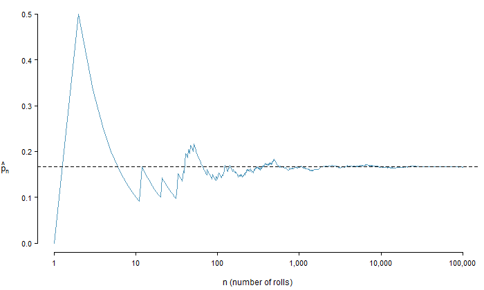
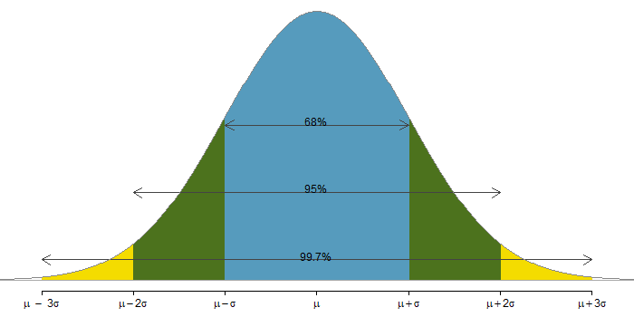
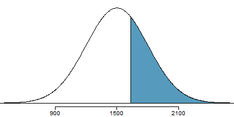
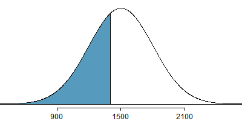
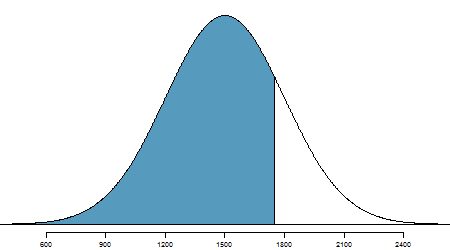

# Random Process and Probabillity


**Learning Outcome**

---
Solve basic probability problems using ratios, proportions, two-way tables and percentages. 
---


In this chapter, we will extend the concept of relative frequencies to understand and calculate the probability of occurrence of a random event. We will also learn about normal distribution, its properties, and methods to calculate probabilities of random events that are described by this distribution.


## Meaning of Probability

An event is **Random** if individual outcomes of it are unpredictable, meaning they have no apparent pattern of occurrence,  but there is nonetheless a predictable distribution (i.e. the frequencies) of those different outcomes over a large number of repetitions of the event.    

The **Probability** of any outcome of a random event can be defined as the proportion of times the outcome would occur in a very long series of repetitions.  

The probability is defined as a proportion, and it always takes values between $0$ and $1$ (inclusively). It may also be displayed as a percentage between $0\%$ and $100\%$.    

* $0\%: \text{event is impossible}$
* $100\%: \text{event is certain}$


The **sample space** of a random experiment is the group of all possible outcomes.

The **event** is some of the outcomes in the sample space, all of them, or none of them.


**Theoretical vs. Experimental Probability**


The ***Theoretical*** probability is the likelihood of occurring of an event. It is simply the ratio of the number of desired outcomes and the number of all possible outcomes. 


The ***experimental probability*** is an estimate of the likelihood of occurring of an event based on repeated trials. 


<span style="color:#08519c"> **Law of Large Numbers** </span> 


Consider: **Rolling a 1 of a die**

If the sample space of a random experiment consists of $n$ equally likely outcomes and an event $E$ consists of $m$ of those outcomes, then

$$\text {Theorerical Probability} : P(E) = \frac{\text{number of outcomes in the event}(m)}{\text{total number of outcomes}(n)}$$

Let $\hat{p_n}$ be the proportion of outcomes that are $1$ after the $n$ rolls. As the number of rolls $(n)$ increases, $\hat{p_n}$ (the relative frequency of rolls, or the experimental probability) will converge to the theoretical probability of rolling a $1,\space p = 1/6.$ The figure shows the convergence for $100,000$ die rolls. 

The tendency of $\hat{p_n}$ to stabilize around $p$, i.e. the tendency of the relative frequency to stabilize around the true probability, is described by the **Law of Large Numbers.**     


As more observations are collected, the observed proportion $\hat{p_n}$ of occurrences with a particular outcome after $n$ trials converges to the true probability $p$ of that outcome. 


```{r, echo=FALSE, message=FALSE, warning=FALSE, include=FALSE}
library(openintro)
data(COL)
# _____ Simulate _____ #
n <- 10^5
x <- sample(0:1, n, TRUE, p = c(5 / 6, 1 / 6))
y <- cumsum(x) / 1:n
X <- c(1:100, seq(102, 500, 2),
	seq(510, 1500, 10), seq(1550, 10000, 50),
	seq(10100, 25000, 100), seq(25250, 100000, 250))
Y <- y[X]

# _____ Plotting _____ #
myPNG('dieProp.png', 700, 420,
      mar = c(3.8, 3.8, 0.5, 0.5))
plot(X, Y,
     log = 'x',
     type = 'l',
     xlab = '',
     ylab = '',
     axes = FALSE,
     col = COL[1],
     lwd = 1.5)
mtext('n (number of rolls)', side = 1, line = 2.5)
abline(h = 1 / 6, lty = 2)
at <- 10^(0:5)
labels <- c('1', '10', '100', '1,000', '10,000', '100,000')
axis(1, at, labels, cex.axis = 0.9)
axis(2, cex.axis = 0.9)
at <- 1 / 6
labels <- expression(paste(hat(p)[n]))
axis(2, at, labels,
     line = 2.3,
     tick = FALSE,
     cex.axis = 1.1)
dev.off()
```

**Die Rolls Simulation**

```{r, out.width = "650px"}

```

The figure shows the fraction of die rolls that are $1$ at each stage in a simulation.
The relative frequency tends to get closer to the probability $1/6 \approx 0.167$ as
the number of rolls increases.


**Example: Calculating Probabilities**

For a group of $10$ students in one of the author’s algebra classes, there are $2$ nursing majors $\textbf (N)$, $4$ business majors $\textbf (B)$, $1$ architect $\textbf (A)$ major, and $3$ undecided $\textbf (U)$ majors. None of the students are double-majors. 

1. Find $P(N)$.
2. Construct a frequency and relative frequency table of the students’ majors.
3. Find $P(B), P(A)$, and $P(U)$.
4. Find $P(\text{philosophy})$.
5. Find the probability of randomly selecting a nursing, business, architect, OR undecided major.
6. Find $P(N) + P(B) + P(A) + P(U)$. Why does the result make sense?


A **random variable** is a numerical measure of an outcome from a random experiment. We often use a capital letter such as X to stand for a random variable.

Let X be the outcome of rolling a six-sided die once. Find the given probability.

1.$P(X=4)$

2.$P(X\le 4)$

3.$P(X>4)$

4.$P(3 \le X \le 6)$


## Finding Probabilities  

<span style="color:#08519c">  **Events are disjoint**  </span>


Two events or outcomes are called  **disjoint or mutually exclusive** if they cannot both happen in the same trial.    
 
When rolling a die, the outcomes $1$ and $2$ are disjoint, and we compute the probability that one of these outcomes will occur by adding their separate probabilities:
$$P(1 \text{ or } 2)=P(1)+P(2)=1/6+1/6=1/3$$

**What about the probability of rolling a $1, 2, 3, 4, 5, \ or \ 6$ ?**

$$
\begin{array}{ll}
P(1 \text{ or } 2 \text{ or } 3 \text{ or } 4 \text{ or } 5 \text{ or }6) = P(1)+P(2)+P(3)+P(4)+P(5)+P(6) \\
=1/6+1/6+1/6+1/6+1/6+1/6 =1
\end{array}
$$

It is no surprise that the probability is $1$, since it is certain that one of the six outcomes must occur.


**Addition Rule of Disjoint Outcomes** 

If $A_1,...,A_k$ represent $k$ disjoint outcomes, then the probability that one of them occurs is given by:
$$P(A_1\text{ or }A_2 \text{ or ... or }A_k)=P(A_1)+P(A_2)+...+P(A_k)$$


Consider a standard deck of cards.

$$
\text {4 suits}
\left\{
\begin{array}{ll}
\text{hearts: } \color{red}{\heartsuit} \\
\text{diamonds: } \color{red}{\diamondsuit} \\
\text{clubs: } \spadesuit \\
\text{spades: } \clubsuit
\end{array}
\right.
$$
$$\text{13 cards in each suit: } Ace, 2, 3, 4, 5, 6, 7, 8, 9, 10, Jack, Queen, King$$
One card is dealt from a well shuffled deck.   

$$
\begin{align}
P(\text{the card is an ace or a king}) &= P(\text{it's an ace})+P(\text {it's a king}) \\
& = 4/52+4/52 \\
& = 8/52 \\
& = 2/13
\end{align}
$$

**Venn Diagram | When events are disjoint**  

$$
\begin{align}
P(\text{the card is an ace or a king}) &= P(\text{it's an ace})+P(\text {it's a king}) \\
& = 4/52+4/52 \\
& = 2/13
\end{align}
$$


```{r, echo=FALSE, message=FALSE, warning=FALSE}
library(VennDiagram)
library(MASS)
#grid.newpage()
area1 <- fractions(4/52)
area2 <- fractions(4/52)
cross.area <- 0
draw.pairwise.venn(area1, area2, cross.area, category = c("Ace", "King"), 
                   lty = rep("blank", 2), 
                   fill = c("#fc8d59", "#91bfdb"), 
                   alpha = rep(0.5, 2), 
                   cat.pos = c(0, 0), 
                   cat.dist = rep(0.025, 2),
                   # fontface = c("bold", "bold", "bold"),
                   fontfamily = "Franklin Gothic Medium Cond")
```


<span style="color:#08519c"> **Events are not disjoint**  </span>

$$
\begin{align}
& P(\text{the card is an ace or a heart}) \\ 
&= P(\text{it's an ace})+P(\text {it's a heart})-P(\text{it's an ace & heart}) \\
& = 4/52+13/52 - \underbrace{1/52}_{\text {adjustment made to avoid double-counting of the ace of hearts}} \\
& = 16/52 \\
& = 4/13
\end{align}
$$


**Venn Diagram - ** a diagram style to illustrate simple set relationships in probability.   

**When events are NOT disjoint**

$$
\begin{align}
& P(\text{the card is an ace or a heart}) \\
& = P(\text{it's an ace})+P(\text {it's a heart})-P(\text{it's an ace AND heart}) \\
& = 4/52+13/52 - 1/52 = 16/52
\end{align}
$$


```{r echo=FALSE, message=FALSE, warning=FALSE, comment=FALSE}
grid.newpage()
area1 <- fractions(4/52)
area2 <- fractions(13/52)
cross.area <- fractions(1/52)
draw.pairwise.venn(area1, area2, cross.area, category = c("Ace", "King"), 
                   lty = rep("blank", 2), 
                   fill = c("#fc8d59", "#91bfdb"), 
                   alpha = rep(0.5, 2), 
                   cat.pos = c(0, 0), 
                   cat.dist = rep(0.025, 2),
                   # fontface = c("bold", "bold", "bold"),
                   fontfamily = "Franklin Gothic Medium Cond")
```


### General Addition Rule of Probability

$$ \bbox[yellow,5px]
{\color{black}{P(A \space or \space B) = P(A) + P(B) - P(A \space and \space B)}}
$$
where $P(A \text{ and } B)$ is the probability that both events occur.

</br>

**If $A$ and $B$ are mutually exclusive**, $P(A \space and \space B) = 0$ 

Therefore, 

$$ P(A \space or \space B) = P(A) + P(B)$$

**Complement Rule | When an event does not occur**

The complement of event $A$ is denoted $A^c$, and $A^c$ represents all outcomes not in $A$. $A$ and $A^c$ are mathematically related:


$$
\begin{align}
& P(A) + P(A^c) = 1 \\
or, \space & P(A^c) = 1 - P(A) 
\end{align}
$$ 

Example: if an event has chance $40\%$, then the chance that it doesn't happen is $60\%$.

**Venn Diagram | Exercise**

$$
\begin{align}
P(email) &=0.73 \\
P(text)  &= 0.62 \\
P(\text {email & text}) &= 0.49 \\
P(\text {only email}) &= 0.73 - 0.49 = 0.24 \\
P(\text{only text}) &= 0.62 - 0.49 = 0.13 \\
P(\text{neither email nor text}) &= 1 - (0.24 + 0.49 + 0.13) = 0.14
\end{align}
$$


```{r, echo=FALSE, message=FALSE, warning=FALSE, comment=NA}
grid.newpage()
area1 <- 0.73
area2 <- 0.62
cross.area <- 0.49
draw.pairwise.venn(area1, area2, cross.area, category = c("Email", "Text"), 
                   lty = rep("blank", 2), 
                   fill = c("#fc8d59", "#67a9cf"), 
                   alpha = rep(0.5, 2), 
                   cat.pos = c(0, 0), 
                   cat.dist = rep(0.025, 2),
                   # fontface = c("bold", "bold", "bold"),
                   fontfamily = "Franklin Gothic Medium Cond")
```


### Multiplication Rule | for independent processes {.build}

If $A$ and $B$ represent events from two different and independent processes, then the probability that both $A$ and $B$ occur can be calculated as the product of their seprarate probabilities:

$$P(A \text{ and } B) = P(A) \times P(B)$$

Similarly, if there are $k$ events $A_1,...,A_k$ from $k$ independent processes, then the probability they all occur is 

$$ \bbox[yellow,5px]
{
\color{black} {P(A_1\text{ and }A_2 \text{ and ... and }A_k)=P(A_1)\times P(A_2)\times...\times P(A_k)}
}
$$


**Example 1:**
If a card is randomly drawn from a well-shuffled deck, what is the probability that it is the ace of hearts? [Note: Ace and Hearts are two independent events.]  

$$
\begin{align}
P(Ace \text{ and } Hearts) &= P(Ace) \times P(Hearts) \\
&= (4/52) \times (13/52) = 1/52
\end{align}
$$


**Example 2:** 

About $9\%$ of people are left-handed. Suppose $5$ people are selected at random from the US population.   
(a) What is the probability that all are right-handed?   
(b) What is the probability that all are left-handed?   
(c) What is the probability that not all of them are right-handed?

$$
\begin{align}
&(a) \space P\text{(All are RH)} = (1-0.09)^5 = 0.624 \\
&(b) \space P\text{(All are LH)} = (0.09)^5 = 0.0000059 \\
&(c) \space P\text{(not all RH)} = 1- P(\text {all RH}) = 1-0.624 = 0.376
\end{align}
$$


### General Multiplication Rule

If $A$ and $B$ represent two outcomes or events, then

$$ \bbox[yellow,5px]
{\color{black}{P(A \space and \space B) = P(A|B) \times P(B)}}
$$


**Conditional Probability**

The conditional probability of the outcome of interest $A$ given condition $B$ is computed as the following:

$$P(A|B) = \frac{P(A \text{ and } B)}{P(B)}$$

**Exercise: Calculating Probabilities from a Contingency Table:**

Table: College enrollment and parents' educational attainment

$$
\begin{array} {l|cc|r}
& \text{parents: degree} & \text{parents: no degree} & \text{total} \\
\hline
\text {teen: college} & 231 & 214 & 445 \\
\text {teen: no college} & 49 & 298 & 347 \\
\hline
\text {total} & 280 & 512 & 792
\end{array}
$$


**a) Finding Marginal and Joint Probabilities:**

If a probability is based on a single variable, it is a <span style="color:blue"> *marginal probability.* </span> The probability of outcomes for two or more variables or processes is called a <span style="color:#de2d26"> *joint probability.* </span>

Example: College enrollment and parents' educational attainment    

$$
\begin{array} {l|cc|c}
& \text{parents: degree} & \text{parents: no degree} & \text{marginal} \\
\hline
\text {teen: college} & \color{red}{0.29} & \color{red}{0.27} & \color{blue}{0.56} \\
\text {teen: no college} & \color{red}{0.06} & \color{red}{0.38} & \color{blue}{0.44} \\
\hline
\text {marginal} & \color{blue}{0.35} & \color{blue}{0.65} & 1.00
\end{array}
$$


$$
\begin{align}
&\color{blue}{\text{Marginal Probability: }} P(\text{teen: college})=\frac{445}{792}=0.56 \\
&\color{red}{\text{Joint Probability: }} P(\text {teen: college and parents: no degree})=\frac{214}{792}=0.27
\end{align}
$$


**b) Finding Conditional Probability:**

Example: College enrollment and parents' educational attainment

$$
\begin{array} {l|cc|r}
& \text{parents: degree} & \text{parents: no degree} & \text{total} \\
\hline
\text {teen: college} & 231 & 214 & 445 \\
\text {teen: no college} & 49 & 298 & 347 \\
\hline
\text {total} & 280 & 512 & 792
\end{array}
$$


$$
\begin{align}
P(\text {teen college | parents degree}) &= \frac{231/792}{280/792} = 0.825 \\
P(\text {teen college | parents no degree}) &= \frac{214/792}{512/792} = 0.418 \\
P(\text {teen no college | parents degree}) &= \frac{49/792}{280/792} = 0.175 \\
P(\text {teen no college | parents no degree}) &= \frac{298/792}{512/792} = 0.582
\end{align}
$$ 


**c) Condition of Independence**

Verify whether one of the following equations holds:

$$ \begin{align}
P(A|B) &= P(A) \tag 1 \\
P(A \space and \space B) &=P (A) \times P(B) \tag 2 
\end{align}
$$

Check if the equality holds in the following equation:

$$
\begin{align}
P(\text{teen college | parent degree})&\stackrel{?}{=} P(\text {teen college}) \\
0.825 &\ne 0.560
\end{align}
$$
Because both sides are not equal, teenager college attendance and parent degree are not independent.


**Two events are mutually exclusive**

If $A$ and $B$ are mutually exclusive events, then they cannot occur at the same time. If asked to determine if events $A$ and $B$ are mutually exclusive, verify one of the following equations holds:

$$
\begin{align}
P(\text{A and B})&= 0 \tag 1 \\
P(\text{A or B}) &= P(A)+P(B) \tag 2
\end{align}
$$

If the equation that is checked holds true, $A$ and $B$ are mutually exclusive. If the equation does not hold, then $A$ and $B$ are not mutually exclusive. 


**At Least One**

A poker hand (5 cards) is dealt from a well shuffled deck. What is the chance that there is at least one ace in the hand?

$$
\begin{align}
&P(\text{at least one ace}) \\
&=1-P(\text{no aces}) \\
&=1-(48/52) \times (47/51) \times (46/50) \times (45/49) \times (44/48) \\
&=34.11\%
\end{align}
$$

## Finding Probabilities from a Normal Distribution

**Properties of a Normal Curve**

* A normal curve is unimodal and symmetric. 

* The mean is equal to the median. 

* Both are the center of the curve.


```{r echo=FALSE, message=FALSE, warning=FALSE}
x=seq(-8,8,length=500)
y3=dnorm(x,mean=0,sd=1/2)
plot(x,y3,type="l",lwd=2,col="green")
y2=dnorm(x,mean=0,sd=2)
lines(x,y2,type="l",lwd=2,col="blue")
y1=dnorm(x,mean=0,sd=1)
lines(x,y1,type="l",lwd=2,col="red")
legend("topright",c("sigma=1/2","sigma=2","sigma=1"),
lty=c(1,1,1),col=c("green","blue","red"))
```


**Empirical Rule**

Probabilities for falling $1,$ $2,$ and $3$ standard deviations of the mean in a normal distribution.

```{r, message=FALSE, warning=FALSE, include=FALSE}
library(openintro)
data(COL)

myPNG("6895997.png", 700, 350,
      mar = c(2, 0, 0, 0))
X <- seq(-4, 4, 0.01)
Y <- dnorm(X)
plot(X, Y,
     type = 'n',
     axes = FALSE,
     xlim = c(-3.2, 3.2),
     ylim = c(0, 0.4))
abline(h = 0, col = COL[6])
at <- -3:3
labels <- expression(mu - 3 * sigma,
                     mu - 2 * sigma,
                     mu - sigma,
                     mu,
                     mu + sigma,
                     mu + 2 * sigma,
                     mu + 3 * sigma)
axis(1, at, labels)
for (i in 3:1) {
  these <- (i - 1 <= X & X <= i)
  polygon(c(i - 1, X[these], i),
          c(0, Y[these], 0),
          col = COL[i],
          border = COL[i])
  these <- (-i <= X & X <= -i + 1)
  polygon(c(-i, X[these], -i + 1),
          c(0, Y[these], 0),
          col = COL[i],
          border = COL[i])
}

# _____ Label 99.7 _____ #
arrows(-3, 0.03,
       3, 0.03,
       code = 3,
       col = '#444444',
       length = 0.15)
text(0, 0.02, '99.7%', pos = 3)

# _____ Label 95 _____ #
arrows(-2, 0.13,
       2, 0.13,
       code = 3,
       col = '#444444',
       length = 0.15)
text(0, 0.12, '95%', pos = 3)

# _____ Label 68 _____ #
arrows(-1, 0.23,
       1, 0.23,
       code = 3,
       col = '#444444',
       length = 0.15)
text(0, 0.22, '68%', pos = 3)

lines(X, Y, col = '#888888')
abline(h = 0, col = '#AAAAAA')
dev.off()
```


```{r, out.width = "800px"}

```


**Linear Transformation of Normal Curve | Standardizing with Z-Scores**

Consider a normally distributed random variable $x$ with mean $\mu$ and sd $\sigma$: $x \tilde \space N(\mu, \sigma)$   

Two-step linear transformation of $x$   

1. subtract $\mu$ from $x$   
2. divide $(x-\mu)$ by $\sigma$   

$$\bbox[yellow,5px]{\color{black}{\text{standard normal deviate: } z = \frac {x-\mu}{\sigma}}}$$   

The **Z-score** of an observation is defined as the number of standard deviations it falls above or below the mean. If the observation is one standard deviation above the mean, its Z-score is 1. If it is 1.5 standard deviations below the mean, then its Z-score is -1.5.


**Linear Transformation | Normal Curve to Standard Normal Curve**


```{r echo=FALSE, message=FALSE, warning=FALSE, comment=NA}
set.seed(3)
x <- rnorm(10000000, 0, 1)
hist(x, xlab = 'z', ylab = '', probability = T, border = NA, main='N(0,1)', axes = F)
curve(dnorm(x,0,1),lwd=2, add=T)
axis(1, at = seq(-5, 5, 1))
mtext('Total area under the curve = 1', 3, 0.3)
```
$$ \bbox[yellow,5px]
{
\color{black}{{\text {Density at z}} = \frac {1}{\sqrt {2\pi}}\exp{-\frac{1}{2}z^2}, -\infty<z<+\infty}
}
$$


**Example: Compute and Interpret a $z$-Score**

The 2014 draft picks for NBA basketball teams have heights that are approximately normally distributed with mean 79.1 inches and standard deviation 3.0 inches (Source: nbadraft.net). Shabazz Napier was the shortest 2014 draft pick with a height of 72 inches. Find the z-score for 72 inches. What does it mean?

$$
z = \frac {x - \mu}{\sigma} \\
z = \frac {72 - 79.1}{3} \\
z = - 2.37
$$

The z-score is –2.37, which means that Napier’s height is 2.37 standard deviations less than the mean.


**Empirical Rules in terms of $z$-scores**

Because the z-score of an observation is the number of standard deviations that the observation is from the mean, we can restate the Empirical Rule in terms of $z$-scores. So, if a distribution is normally distributed, then

$68\%$ of its z-scores lie between –1 and 1

$95\%$ of its z-scores lie between –2 and 2

$99.7\%$ of its z-scores lie between –3 and 3


**Normal Probability Examples | z-score to percentile**

<div class="blue">
Cumulative SAT scores are approximated by a normal model with $\mu = 1500 \text { and } \sigma = 300$.   
</div>

**What is the probability that a randomly selected SAT taker scores at least 1630 on the SAT?**


```{r, echo=FALSE, message=FALSE, warning=FALSE, include=FALSE}
library(openintro)
data(COL)

myPNG("satAbove1630.png", 400, 200,
      mar = c(1.2, 0, 0.5, 0),
      mgp = c(3, 0.17, 0))
normTail(1500, 300,
         U = 1630,
         axes = FALSE,
         col = COL[1])
axis(1, at = c(900, 1500, 2100),
     cex.axis = 0.8)
dev.off()
```
```{r, out.width = "400px"}

```
<br/>

$z = \frac{x-\mu}{\sigma}=\frac{1630-1500}{300}=\frac{130}{300}=0.43$   

$P(z\ge0.43)=0.3336$  

The probability that a randomly selected score is at least 1630 on the SAT is 33%.


**Exercise**

People’s IQ scores are normally distributed with mean $\textbf {100}$ points and standard deviation $\textbf {15}$ points. Let X be the IQ (in points) of a randomly selected person. Find the probability that a randomly selected person has an IQ

1. less than $\textbf {78}$ points.

2. greater than $\textbf {117}$ points.


**Normal Probability Examples | z-score to percentile**

**Edward earned a 1400 on his SAT. What is his percentile?**

<div class="centered">
```{r, echo=FALSE, message=FALSE, warning=FALSE, include=FALSE}
myPNG('satBelow1400.png', 400, 200,
      mar = c(1.5, 0, 0.5, 0),
      mgp = c(3, 0.45, 0))
normTail(1500, 300, 1400,
         axes = FALSE,
         col = COL[1])
axis(1, at = c(900, 1500, 2100))
dev.off()
```
```{r, out.width = "400px"}

```

$z = \frac{x-\mu}{\sigma}=\frac{1400-1500}{300}=\frac{100}{300}=-0.33$   

$P(z\le-0.33)=0.3707$    

Edward is at the 37th percentile.
</div>


**Normal Probability Examples | percentile to z-score**

Carlos believes he can get into his preferred college if he scores at least in the 80th percentile on the SAT. What score should he aim for?

<div class="columns-2">
```{r, echo=FALSE, message=FALSE, warning=FALSE, include=FALSE}
#===> plot <===#
myPNG("satBelow1800.png", 450, 250,
      mar = c(1.2, 0, 0.5, 0),
      mgp = c(3, 0.17, 0))
normTail(1500, 300,
         L = 1752,
         col = COL[1],
         cex.axis = 0.6)
dev.off()
```
```{r, out.width = "400px"}

```
<br/>

At $80th$ percentile, $z = 0.84$   

$$
\begin{align}
z & = \frac{x-\mu}{\sigma} \\
0.84 & = \frac{x-1500}{300} \\
0.84 \times 300 + 1500 & = x \\
x & = 1752
\end{align}
$$    
</div>

<br>
The 80th percentile on the SAT corresponds to a score of 1752.

**Practice Problems**

1. The scores on the Wechsler IQ test are normally distributed with mean **100** points and standard deviation **15** points. Film director Quentin Tarantino is reported to have a z-score of **z = 4** (Source: Chicago Tribune). What is his IQ score?

2. A professor gives a test to her calculus students. The scores are approximately normally distributed with mean **75** points and standard deviation **9** points. The professor decides to give As to approximately **10%** of the students but not less than 10%. Find the cutoff score for an A.

3. Maria and Roberto took tests on probability in two different sections of prestatistics. Maria scored **91** points on a test with mean **77** points and standard deviation 6 points. Roberto scored **80** points on a test with mean **68** points and standard deviation **4** points. The test scores on each test are approximately normally distributed.

  - Find the z-score for Maria’s test score. What does it mean in this situation?
  - Find the z-score for Roberto’s test score. What does it mean in this situation?
  - Assuming a typical student in one class knows the material as well as a typical student in the other class, determine whether Maria did relatively better than Roberto.


4. Assuming the sodium levels per serving of the low-salt chips are approximately normally distributed with mean **85** mg and standard deviation **5** mg, find the probability that a randomly selected bag would have at least **104** mg of sodium per serving.


5. What is the probability that a randomly selected data point from a normal distribution can be classified as an outlier?

$$ Q_3 + 1.5 \times IQR \le \text {outlier} \\
\text {outlier} \le Q_1 - 1.5 \times IQR
$$ 

