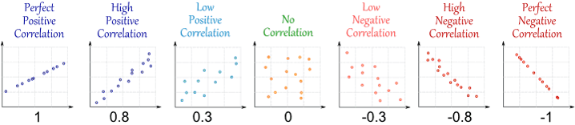
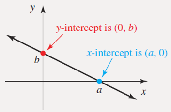
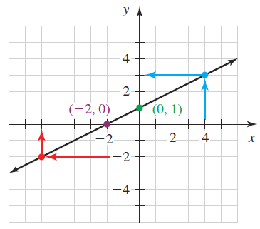
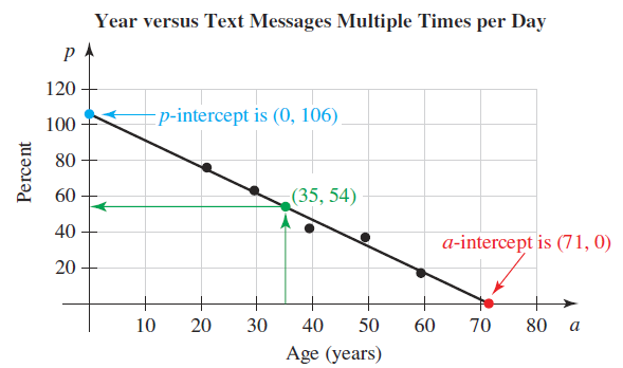

# Describing Association of Two Variables Graphically

**Learning Outcome:**

---
Describe associations of two variables graphically using a scatterplot.
---

In this chapter, we will explore how to visually describe association between two quantitative variables using scatterplot. We will also introduce a method to measure linear association between those variables. 


## Univariate Data

```{r, echo=FALSE, message=FALSE, warning=FALSE}
n = 100000;  u3 = rbeta(n, 13, 37)           
cond = u3 > .01 & u3 < .99                   
v3 = u3[cond];  x3 = v3[1:1000]            
x3 <- x3*100
par(mfrow=c(1,2))                       
hist(x3, prob=T, breaks = 20, main = "Age of mothers", xlab = "Maternal Age (years)")

n = 1000
y1 = rnorm(n, 120, 10)
hist(y1, probability = T, breaks = 20, main = "Birthwight of their babies", xlab = "Birthweight (ounces)")

par(mfrow=c(1,2)) 
```

## Bivariate Data - Scatter Diagram 

* Scatterplots exhibit the relationship between two numeric variables.
* They are used for detecting patterns, trends, and relationships.

```{r, echo=FALSE, message=FALSE, warning=FALSE}
library(plotly)
plot_ly(x = ~x3, y = ~y1) %>% 
    layout(
        xaxis = list(title = "Maternal Age (years)"),
        yaxis = list(title = "Birthweight (ounces)")
        )
```   
   

## Bivariate Data - *Positive Association*

* Unit of observation used in the plot is 'county'.

**The plot shows positive association between education and income.**

```{r, echo=FALSE, message=FALSE, warning=FALSE}
library(openintro)
countyComplete  <- read.csv("C:/Users/abanerjee/OneDrive - National Education Association/Amlan/PGCC/pathway_to_statistics/cc.csv")
t <- list(
  family = "sans serif",
  size = 14,
  color = 'black')
plot_ly(data = countyComplete, x = ~bachelors, y = ~per_capita_income) %>% 
      layout(
        xaxis = list(title = "Percent with Bachelor's Degree"),
        yaxis = list(title = "Per Capita Income")
        )
```   

## Linear Association between Variables

**Linear Association:** the scatter diagram is clustered around a straight line 

* Positive (Linear) Association: **above average** values of one variable tend to go with **above average** values of the other; scatterplot slopes up.
* Negative (Linear) Association: **above average** values of one variable tend to go with **below average** values of the other; scatterplot slopes down.
* No (Linear) Association: Scatterplot shows no direction


## Correlation Coefficient

```{r echo=FALSE, message=FALSE, warning=FALSE}
par(mfrow=c(1,3)) 
n = 200
x <- rnorm(n, 0, 1); x <- abs(x)
y1 <- rnorm(n, 0, 1) + (x)
plot(x, (y1), pch=19)
y2 <- rnorm(n, 0, 1) + exp(x)
plot(x, (y2), pch=19)
y3 <- rnorm(n, 0, 1) + x^(2)
plot(x, (y3), pch = 19)
par(mfrow=c(1,3)) 
```

<span style="color:#386cb0"> **Correlation coefficient: $\lbrace r | -1 \le r \le +1 \rbrace$** </span>    


It measures **linear association**, i.e. how tightly the points are clustered about a straight line. 


## Calculating Correlation Coefficient

```{r eval=FALSE, message=FALSE, warning=FALSE, include=FALSE}
x <- c(1, 2, 3, 4, 5)    
y <- c(2, 3, 1, 6, 6)

mean_x <- mean(x)
mean_y <- mean(y)

sd_x <- sqrt(mean(x ^ 2) - mean(x)^2)
sd_y <- sqrt(mean(y ^ 2) - mean(y)^2)

z_x <- (x - mean_x)/sd_x
z_y <- (y - mean_y)/sd_y

product <- z_x * z_y

r <- mean(product)
```
```{r eval=FALSE, comment=NA, include=FALSE}
z_x # Step 1a: calculate z-scores of x (use population sd)
z_y # Step 1b: calculate z-scores of y (use population sd)
z_x * z_y # Step 2: Multiple corresponding pairs of z-scores
r # Step 3: calculate the average of the product (z_x * z_y)
```

$$
\begin{array}{ccrrr}
x & y & z_x & z_y & z_x \cdot z_y \\
\hline
1 & 2 & -1.414 & -0.777  & 1.098    \\
2 & 3 & -0.707 & -0.291  & 0.206    \\
3 & 1 &      0 & -1.262  & 0        \\   
4 & 6 & 0.707  &  1.165  & 0.824    \\  
5 & 6 & 1.414  &  1.165  & 1.648    \\
\hline                              \\  
\bar x = 3  &  \bar y = 3.6  &    & \text{mean (Col 5)} & r=0.755    \\
\hline
\end{array}
$$


**Formula for Correlation Coefficient**

$\text {If the data are} \space (x_i, y_i), 1\le i\le n, \text {then}$   
$$\bbox[yellow,5px]
{
\color{black}{r = \frac{1}{n}\sum_{i=1}^n \left(\frac{x_i-\mu_x}{\sigma_x}\right)\left(\frac{y_i-\mu_y}{\sigma_y}\right)}
}
$$


<div class="centered">
```{r, out.width = "750px"}

```

## Properties of Correlation Coefficient

1. $r$ is a pure number with no units
2. $-1\le r\le +1$
3. Adding a constant to one of the variables does not affect $r$
4. Multiplying one of the variables by a positive constant does not affect $r$
5. Multiplying one of the variables by a negative constant switches the sign of $r$ but does not affect the absolute value of $r$

<br/>

**What correlation coefficient does not tell you?**

**ASSOCIATION IS NOT CAUSATION.**

If two variables have a non-zero correlation, then they are related to each other in some way, but that does not mean that one causes the other.

**CORRELATION COEFFICIENT MEASURES LINEAR ASSOCIATION BETWEEN TWO VARIABLES.**

Two variables appear to strongly associated, but $r$ is close to $0$. This is because the relationship is clearly nonlinear. $r$ measures linear association. Don't use it if the scatter diagram is nonlinear.

```{r, message=FALSE, warning=FALSE}
set.seed(2468)
n = 500
x <- rnorm(n, 0, 1)
y <- rnorm(n, 0, 1) + x^2 + x^4 
plot(x, y, pch = 20, main = paste0('r = ', round(cor(x,y),2)))
```

```{r eval=FALSE, engine.path="C:/Users/abanerjee/AppData/Local/Continuum/anaconda3/python.exe", include=FALSE}
import numpy as np
import matplotlib.pyplot as plt
 
# Create data
N = 500
x = np.random.normal(0, 1, N)
y = np.random.normal(0, 1, N) + x**2 + x**4
colors = (0,0,0)
area = np.pi*1
 
# Plot
plt.scatter(x, y, s=area, c=colors, alpha=0.5)
plt.title('Scatter plot pythonspot.com')
plt.xlabel('x')
plt.ylabel('y')
plt.show()
```

## Modeling Linear Association 

A **linear model** is a nonvertical line that describes the association between two quantities in an authentic situation

```{r, message=FALSE, warning=FALSE}
# Create the predictor and response variable.
y <- c(151, 174, 138, 186, 128, 136, 179, 163, 152, 131)
x <- c(63, 81, 56, 91, 47, 57, 76, 72, 62, 48)
relation <- lm(y~x)

# Plot the chart.
plot(y,x,col = "blue",main = "Height & Weight Regression",
abline(lm(x~y)),cex = 1.3,pch = 16,xlab = "Height in cm",ylab = "Weight in kg")
```

The linear model allows us to estimate the value of the output or dependent variable $(y)$ for any value of the input or explanatory variable $(x)$. 

**Errors in Estimation**

The error in an estimate is the amount by which the estimate differs from the actual value of $y$, for a given value of $x$.

$\text {error}  = \hat y_{est} - y_{obs}$

For an ***overestimate***, the error is positive.

For an ***underestimate***, the error is negative.


[Linear Model Examples](https://amlanbanerjee.shinyapps.io/bivariateregression/)


### Intercepts of a Line

* An x-intercept of a line is a point where the line and the x-axis intersect. The y-coordinate of an x-intercept is 0.

* A y-intercept of a line is a point where the line and the y-axis intersect The x-coordinate of a y-intercept is 0.




**Practice Problem 1: Finding Intercepts and Coordinates**

1. Find the x-intercept of the line.

2. Find the y-intercept of the line.

3. Find y when x = 4.

4. Find x when y = –2.




**Practice Problem 2**

Age  | Percent
------------- | -------------
21.0  | 76
29.5  | 63
39.5  | 42
49.5  | 37
59.5  | 17


1. Draw a model that describes the association between age and cell phone usage.

2. Predict the percentage of 35-year-old cell phone users. 

3. Find the p-intercept. What does it mean in this situation? 

4. Find the a-intercept. What does it mean in this situation?

